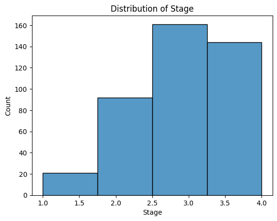
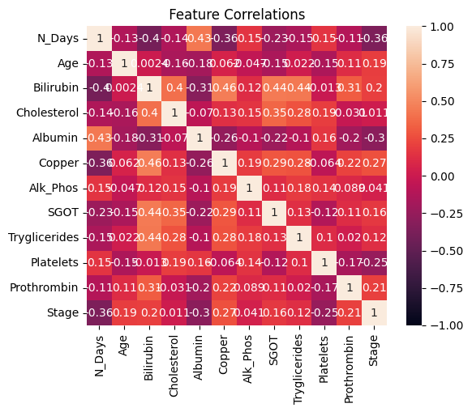
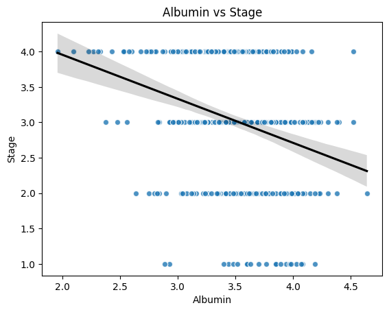
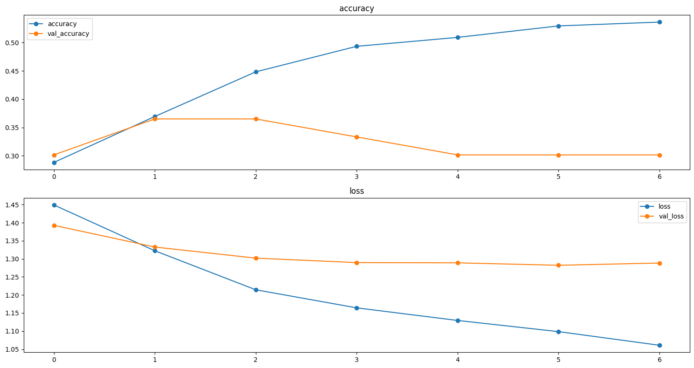
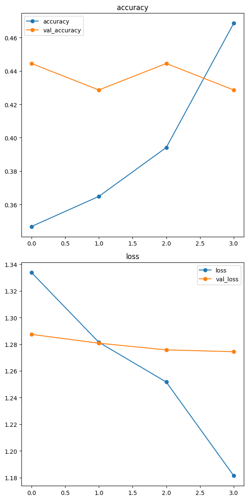
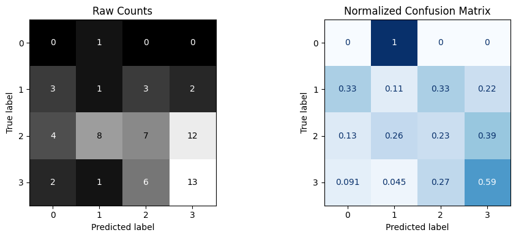

# Cirrhosis Stage Prediction Using Deep Learning  
*A complete machine learning pipeline for predicting cirrhosis severity (Stage 1–4)*

---

## 1. Project Overview
This project develops an end-to-end classification system that predicts the **histologic stage of cirrhosis** using 19 clinical and biochemical features.  
It includes:

- Data cleaning and preprocessing  
- Exploratory Data Analysis (EDA)  
- Handling class imbalance  
- Building & tuning a Deep Neural Network  
- Clinical interpretation of results  
- Stakeholder-focused recommendations  

The final goal is to assess whether deep learning can support early and accurate liver disease staging.

---

## 2. Dataset Description
The dataset contains **418 patients** with 20 attributes, including:

- **Demographics:** Age, Sex  
- **Symptoms:** Edema, Ascites, Hepatomegaly, Spiders  
- **Lab tests:** Bilirubin, Albumin, SGOT, Cholesterol, Prothrombin, Copper  
- **Survival indicator:** N_Days  
- **Target variable:** **Stage** (1 to 4)

ID column was removed during preprocessing.

---

## 3. Data Cleaning & Preprocessing
### Steps performed:
- Dropped ID column  
- Filled NA values using:
  - Numeric → **mean imputation**
  - Ordinal → **most frequent**
  - Categorical → **constant (“MISSING”)**
- Encoded:
  - Ordinal → **OrdinalEncoder**  
  - Nominal → **OneHotEncoder**  
- Scaled numeric & ordinal features with **StandardScaler**
- Detected and fixed inconsistent category labels
- Split the data into:
  - **70% Train**
  - **15% Validation**
  - **15% Test**
- Addressed class imbalance using **SMOTE**
- Encoded the target with **LabelEncoder** and **LabelBinarizer**

---

## 4. Exploratory Data Analysis

### **4.1 Stage Distribution**
  
Key notes:
- Imbalanced distribution  
- Stages 2 and 3 dominate  
- Early stages (0/1) are minority → harder to classify  

---

### **4.2 Correlation Heatmap**

Findings:
- **Albumin**: strong negative correlation with Stage  
- **Bilirubin**, **Copper**, **Prothrombin**: positive correlation  
- Liver biomarkers show relationships consistent with medical expectations  

---

### **4.3 Albumin vs Stage**
  
Interpretation:
- Clear downward trend  
- Lower albumin → higher disease severity  
- Highly informative feature for the ANN  

---

## 5. Deep Learning Model (ANN)

### **5.1 Baseline Architecture**
- Dense(64, relu)  
- Dropout(0.2)  
- Dense(4, softmax)  
- Optimizer: Adam  
- Loss: Categorical Crossentropy  
- EarlyStopping (monitor: val_accuracy, patience=5)

---

### **5.2 Baseline Training History**

Insights:
- Training accuracy increases  
- Validation accuracy stagnates (~33%)  
- Validation loss plateaus → **overfitting**  
- Weak performance on rare stages (0 and 1)

---

## 6. Hyperparameter Tuning

Used **Keras Tuner (Hyperband)** to tune:
- Number of hidden units  
- Dropout rate  
- Optimizer type  

Best hyperparameters found:
`units = 128
dropout = 0.3
optimizer = 'adam'` 

Validation accuracy improved to **~44%**.

---

### **6.1 Tuned Training History**
 

Observations:
- Better generalization  
- Smoother training/validation curves  
- Reduced overfitting compared to baseline  

---

## 7. Final Model Evaluation

### **7.1 Confusion Matrix (Tuned Model)**
  

Key points:
- Strongest performance on **Stage 3**  
- Stage 2 reasonably detected  
- Stages 0 and 1 remain difficult → class imbalance + subtle patterns  
- Overall accuracy and AUC improved after tuning  

---

## 8. Interpretation & Clinical Relevance
### The model **can**:
- Learn nonlinear biochemical relationships  
- Predict middle and late stages with reasonable consistency  
- Support clinicians as a **decision-aid**, not a replacement  

### The model **cannot yet**:
- Reliably detect early (subtle) stages  
- Compensate for missing biomarkers  
- Replace histologic diagnosis  

This is expected in small, imbalanced medical datasets.

---

## 9. Stakeholder Takeaways

### **For Clinicians**
- Albumin, Bilirubin, Prothrombin are meaningful predictors  
- Model reflects clinical trends but is not diagnostic-grade  
- Better performance for late-stage cirrhosis  

### **For Data Teams**
- Class imbalance is the key bottleneck  
- Additional biomarkers or larger datasets would improve performance  
- The architecture is stable and extendable  

### **For Decision Makers**
- Promising prototype  
- Not deployable without:
  - more data  
  - cross-validation  
  - clinical validation  

---

## 10. Potential Improvements
To enhance model robustness:

1. **Class weighting**  
2. Deeper network architectures  
3. Hyperparameter tuning of learning rate & batch size  
4. Adding dropout layers  
5. External medical datasets  
6. Incorporating domain knowledge or clinical rules  
---

